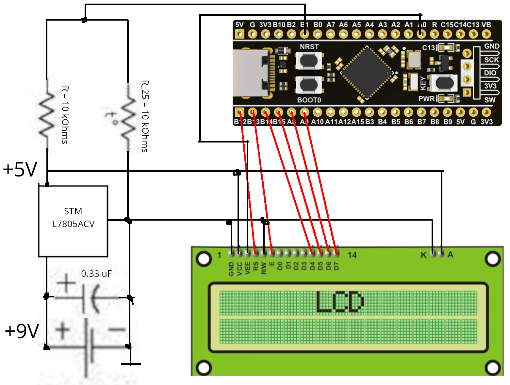

# STM32 thermometer project

The aim of this project is to create a microcontroller powered digital thermometer using an NTC thermistor.

## Parts used
* WeAct Black Pill V3.0 with STM32F401CDU6 chip
* LCD 1602A 16x2 display
* EPCOS B57164K0103+000 thermistor
* STM L7805ACV voltage regulator
* 0.33 uF capacitor
* 10 kOhm resistor
* 9V battery

## Wiring diagram

## Principals of operation

### Power
The LCD module must be powered a 5V source. My options were to use either 3 1.5V AA batteries and hope that it would work, or use a higher voltage source with voltage regulation circuitry. I went with the second option.
The manufacturer recommends that users connect a 0.33 uF or greater capacitor to the voltage regulator, so this is what I did.

The microcontroller on the other hand can take only about 3.3V. While I did have a 3.3V voltage regulator, in the end I didn't use it, since my programmer was connected all the time anyway.

### LCD
The most complex part of the project was interfacing with the display module. Either a 4-bit or an 8-bit interface can be used when communicating with the LCD. I chose to use the 4-bit interface due to a lack of breadboard compatible wires. I also wired the RW pin to ground for the same reasons.

The LCD's contrast can be regulated using the V0 pin. I didn't buy a potentiometer for this, which posed some problems. And when V0 was connected to ground or 3.3V, the display contents were illegible. In the end, I used a hard-coded PWM signal from the microcontroller, which worked nicely.

### Thermistor and temperature calculation
Thermistors are elements whose resistance varies greatly with temperature. An NTC thermistor's resistance becomes lower as its temperature rises.

The thermistor together with the resistor are connected in series to the 5V source. To minimises errors causes by Joule's law, both of them must have a high resistance.

The thermistors voltage is then measured using the Black Pill's ADC. The ADC's output can then be used to calculate the thermistor's current resistance.
Thermistor temperature characteristics are provided by the manufacturer [here](https://www.tdk-electronics.tdk.com/web/designtool/ntc/). Using this table and linear interpolation, the thermistor's current temperature can be found.

The result is noisy, so instead of displaying the temperature that was just measured, I instead display the average of what was measured over the last 60 seconds.

### Results and further work
Here is a picture of the resulting circuit:

While the thermometer does work, it has some problems. The first is it's messy state. Instead of buying breadboard wires, I bought traditional wires and had to solder most of the parts together. In the long run, a box could be made to host the device.
The second problem is the thermometer's accuracy. Errors come from a lot of different sources: the components themselves, the ADC, and Joule's Law.
After some time the thermometers measurements end up a lot higher than is expected. While excessive heating seams the most likely explanation, it doesn't have to be the only one.
